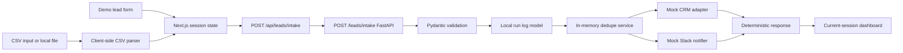
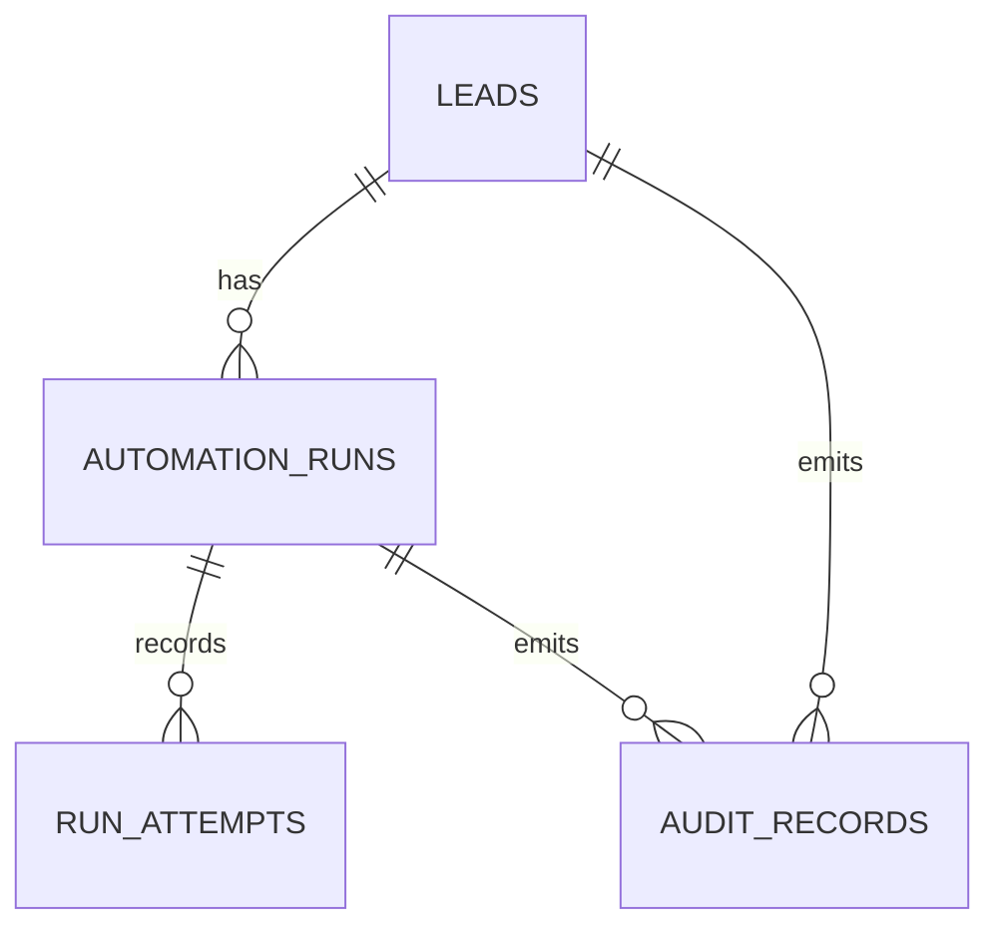

# DESIGN.md

## 1. Meta

| Field | Value |
|---|---|
| Last updated | 2026-06-01 |
| Status | active draft |
| Scope | Architecture for greenfield portfolio demo |
| Current phase | Phase 4 slice 1 - backend persistence foundation |
| Related docs | `REQ.md`, `CONTEXT.md`, `EXEC_PLAN.md`, `RUNBOOK.md`, `TDD.md`, `STATE.md` |

## 2. Design Objective

Design a local-first sales operations workflow automation demo that shows how lead intake can move from manual copy/paste work to a traceable, testable automation pipeline. The system remains safe for portfolio use by defaulting to mock integrations and synthetic data.

Phase 4 slice 1 adds the backend persistence foundation against the Phase 2 deterministic backend contract and Phase 3 frontend demo. It includes SQLAlchemy models, an Alembic initial migration, a local PostgreSQL Compose service, and repository tests. Persistence is not wired into the public intake route yet. Real integrations, auth, deployment, and GitHub Actions remain planned later or out of scope.

## 3. Stack

| Layer | Choice | Rationale | Phase |
|---|---|---|---|
| Backend API | FastAPI, Python 3.12+, Pydantic | Strong validation, clear OpenAPI surface, good portfolio readability | Phase 1 |
| Lead domain | Pydantic schemas, deterministic services, mock adapters | Local-safe workflow foundation without persistence or network calls | Phase 2 |
| Frontend | Next.js App Router, TypeScript, Tailwind CSS | Planned portfolio UI stack with local route handlers and component tests | Phase 3 |
| Tables | TanStack Table | Filterable current-session run dashboard | Phase 3 |
| Frontend tests | Vitest, Testing Library, jsdom | Fast local UI behavior checks | Phase 3 |
| Persistence | SQLAlchemy, Alembic, PostgreSQL through Docker Compose | Durable relational records for leads, attempts, audit trails | Phase 4 slice 1 foundation |
| Integrations | CRM adapter and Slack adapter in mock mode by default | Keeps boundaries clear without real external calls | Phase 2+ |

## 4. Repository Structure

```text
/
  backend/
    app/
      # FastAPI app, settings, health endpoint, lead intake domain
  tests/
    # Backend tests
  apps/
    web/
      # Next.js app, demo form, CSV import UI, session dashboard
  alembic/
    # Database migration environment and initial persistence migration
  pyproject.toml
  uv.lock
  compose.yml
  package.json
  pnpm-lock.yaml
  pnpm-workspace.yaml
  AGENTS.md
  CONTEXT.md
  DESIGN.md
  EXEC_PLAN.md
  README.md
  REQ.md
  RUNBOOK.md
  STATE.md
  TDD.md
  .env.example
  .gitignore
```

## 5. Architecture Flow

Current Phase 3 local flow:

```text
Next.js UI -> Next.js local proxy -> FastAPI intake -> validation -> local run log model -> dedupe -> mock CRM -> mock Slack -> UI session dashboard
```



Phase 4 slice 1 persistence foundation:



## 6. Implemented API Contract

`POST /leads/intake` accepts:

- `email`, `first_name`, `last_name`, `company_name`, `company_domain`, `source`;
- optional `job_title`, `phone`, `message`;
- `lead_score` integer from 0 to 100;
- `source` values: `demo_form`, `csv_upload`, `manual`.

It returns `201` with `lead_id`, `run_id`, `run_status`, `dedupe`, `crm`, and nullable `slack`, or FastAPI/Pydantic `422` validation details for invalid payloads.

The frontend proxy preserves backend status codes and response bodies. If the local backend is unreachable, it returns a local `502` response with a suggested action.

## 7. Data And State Boundaries

- Backend Phase 2 state is deterministic and not persisted; each normal request uses a fresh intake service.
- Frontend Phase 3 dashboard records are stored only in browser `sessionStorage`.
- Same-session duplicate hints compare submitted email and company domain in the browser session.
- Backend `dedupe.status` remains the authoritative backend response and is displayed separately from frontend hints.
- SQLAlchemy tables now exist for leads, automation runs, run attempts, and audit records.
- Repository tests validate persistence behavior with SQLite as a unit-test fallback; PostgreSQL remains the local integration target.
- Durable API dedupe, admin run history, owner assignment, failure taxonomies, retry endpoints, and seeded demo data require future persistence/API wiring.

## 8. Adapter Boundaries And Mock Mode

- Core workflow logic calls CRM and Slack through adapters, not direct SDK calls.
- Default adapter mode is mock/logging only.
- Mock adapters are deterministic and testable.
- Real HubSpot, Slack, Google Sheets, OpenAI, paid, or external API calls require explicit user approval before implementation or execution.
- `.env.example` may include optional placeholder variables, but real secrets must not be committed.

## 9. Open Design Questions

| ID | Question | Default until answered |
|---|---|
| DQ-001 | What rule assigns leads to sales reps? | Future deterministic placeholder or persistence-backed owner |
| DQ-002 | What qualifies a lead for CRM sync and Slack notification? | Phase 2 default: `lead_score >= 70` |
| DQ-003 | How strict should company-domain dedupe be? | Email exact match first, company domain possible duplicate second |
| DQ-004 | Should future persistence tests use SQLite fallback? | Prefer PostgreSQL integration; allow SQLite only if justified |
| DQ-005 | Should manual retry be a backend endpoint or admin-only local simulation first? | Backend endpoint after persistence/failure records exist |
