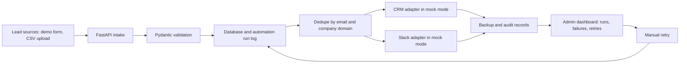

# DESIGN.md

## 1. Meta

| Field | Value |
|---|---|
| Last updated | 2026-06-01 |
| Status | active draft |
| Scope | Architecture for greenfield portfolio demo |
| Current phase | Phase 1 - backend foundation |
| Related docs | `REQ.md`, `CONTEXT.md`, `EXEC_PLAN.md`, `RUNBOOK.md`, `TDD.md`, `STATE.md` |

## 2. Design Objective

Design a local-first sales operations workflow automation demo that shows how lead intake can move from manual copy/paste work to a traceable, testable automation pipeline. The system should remain safe for portfolio use by defaulting to mock integrations and synthetic data.

Phase 1 adds only the backend foundation: app creation, local-safe configuration, and health checking. Persistence, lead processing, adapters, and frontend surfaces remain planned.

## 3. Planned Stack

| Layer | Choice | Rationale | Phase |
|---|---|---|---|
| Backend API | FastAPI, Python 3.12+, Pydantic | Strong validation, clear OpenAPI surface, good portfolio readability | Phase 1 |
| Persistence | SQLAlchemy, Alembic, PostgreSQL through Docker Compose | Durable relational records for leads, attempts, audit trails | Phase 2 |
| Backend tooling | `uv`, pytest, Ruff, mypy | Fast local workflow and quality gates | Phase 1 |
| Frontend | Next.js, TypeScript, Tailwind CSS, shadcn/ui | Modern portfolio UI with practical admin dashboard patterns | Phase 3 |
| Tables | TanStack Table | Filterable run dashboard | Phase 3 |
| Integrations | CRM adapter and Slack adapter in mock mode by default | Keeps boundaries clear without real external calls | Phase 2 |

## 4. Planned Monorepo Structure

The structure below reflects the Phase 1 backend foundation and planned future additions.

```text
/
  backend/
    app/
      # FastAPI app, local settings, health endpoint
  tests/
    # Backend tests
  apps/
    web/
      # planned Next.js app, demo form, CSV import UI, admin dashboard
  docs/
    # planned diagrams, handoff guide, demo script
  scripts/
    # planned local seed, smoke, and quality-gate helpers
  pyproject.toml
  uv.lock
  AGENTS.md
  CONTEXT.md
  DESIGN.md
  EXEC_PLAN.md
  README.md
  REQ.md
  RUNBOOK.md
  STATE.md
  TDD.md
  .env.example
  .gitignore
```

## 5. Architecture Flow

Planned flow:

```text
lead sources -> FastAPI intake -> validation -> database/run log -> dedupe -> CRM adapter -> Slack adapter -> backup/audit -> admin dashboard
```



## 6. Conceptual Entities

These are conceptual only; exact schemas will be designed in implementation phases.

| Entity | Responsibility | Notes |
|---|---|---|
| Lead | Captured person/company interest from form or CSV | Includes source, contact fields, company data, validation state |
| LeadOwner | Sales rep assignment target | 5 fake sales reps for demo routing |
| AutomationRun | High-level workflow execution for a lead or import row | Tracks queued, success, failed, retried |
| AutomationAttempt | Individual execution attempt for a run | Preserves retry history and errors |
| CrmSyncRecord | Result of CRM adapter create/update simulation | Stores mock external IDs and sync status |
| NotificationRecord | Result of Slack adapter simulation | Stores notification status and rendered message metadata |
| CsvImportBatch | Grouping for uploaded CSV rows | Tracks file-level import state and row outcomes |

## 7. Adapter Boundaries And Mock Mode

- Core workflow logic must call CRM and Slack through adapters, not direct SDK calls.
- Default adapter mode is mock/logging only.
- Mock adapters must be deterministic and testable.
- Real HubSpot, Slack, Google Sheets, OpenAI, paid, or external API calls require explicit user approval before implementation or execution.
- `.env.example` may include optional placeholder variables, but real secrets must not be committed.
- Adapter contract tests should prove expected behavior without network access.

## 8. Failure And Retry Model

- Validation failures should stop unsafe downstream actions and surface structured details.
- Adapter failures should create failed automation attempts with error type and suggested action.
- Manual retry should create a new attempt rather than overwriting failure history.
- Run status should reflect the latest meaningful state while preserving attempt history.

## 9. Data And Audit Expectations

- Lead processing must be auditable from intake through CRM/Slack mock outcomes.
- Backup/audit records should support portfolio explanation of traceability.
- Demo data must be synthetic.
- Production data and real credentials are forbidden unless explicitly approved and documented.

## 10. Open Design Questions

| ID | Question | Default until answered |
|---|---|
| DQ-001 | What rule assigns leads to sales reps? | Deterministic placeholder, likely round-robin |
| DQ-002 | What qualifies a lead for CRM sync and Slack notification? | Simple configurable rule |
| DQ-003 | How strict should company-domain dedupe be? | Email exact match first, company domain possible duplicate second |
| DQ-004 | Should unit tests use SQLite fallback? | Prefer PostgreSQL integration; allow SQLite only if justified |
