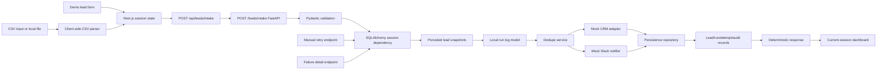
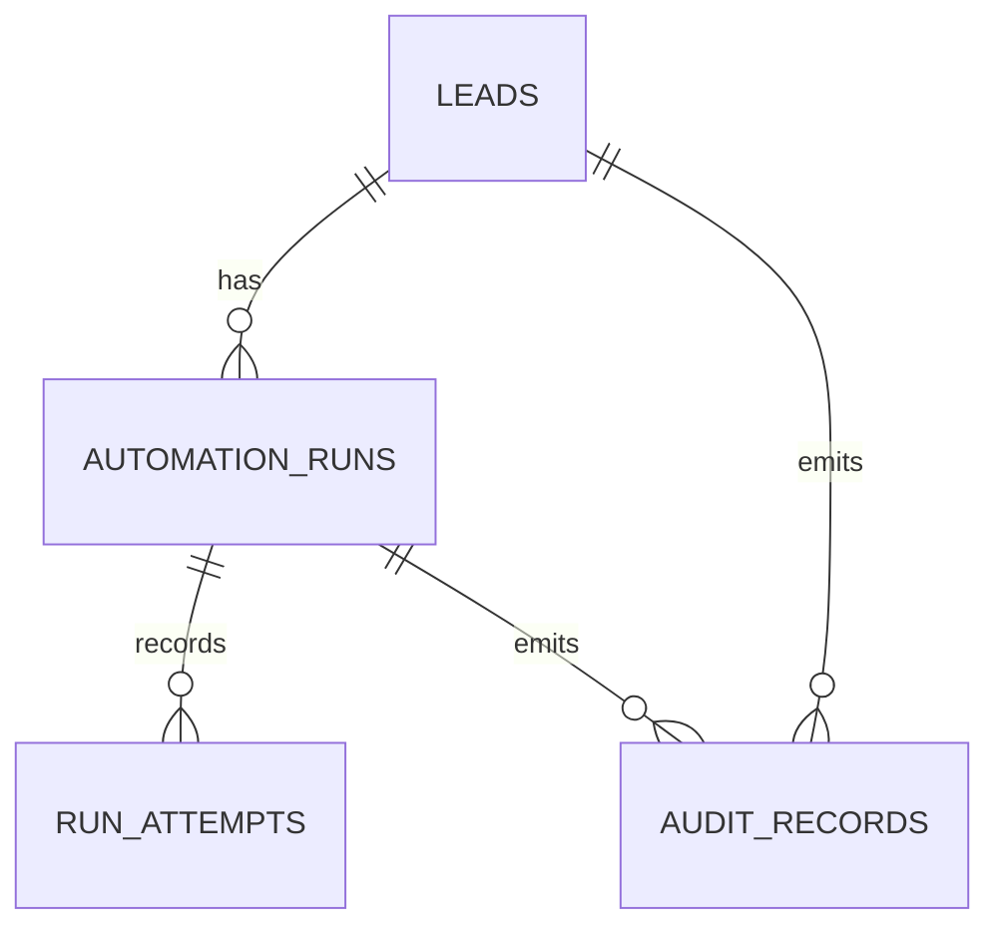

# DESIGN.md

## 1. Meta

| Field | Value |
|---|---|
| Last updated | 2026-06-01 |
| Status | active draft |
| Scope | Architecture for greenfield portfolio demo |
| Current phase | Phase 4 slice 3 - persisted failure details and manual retry endpoints |
| Related docs | `REQ.md`, `CONTEXT.md`, `EXEC_PLAN.md`, `RUNBOOK.md`, `TDD.md`, `STATE.md` |

## 2. Design Objective

Design a local-first sales operations workflow automation demo that shows how lead intake can move from manual copy/paste work to a traceable, testable automation pipeline. The system remains safe for portfolio use by defaulting to mock integrations and synthetic data.

Phase 4 slice 3 builds on the persistence-backed intake flow by exposing backend-only failure detail and manual retry endpoints. It keeps the public intake response contract and mock CRM/Slack adapters while persisting local leads, automation runs, attempts, and audit records through explicit database-session dependencies. Real integrations, auth, deployment, and GitHub Actions remain planned later or out of scope.

## 3. Stack

| Layer | Choice | Rationale | Phase |
|---|---|---|---|
| Backend API | FastAPI, Python 3.12+, Pydantic | Strong validation, clear OpenAPI surface, good portfolio readability | Phase 1 |
| Lead domain | Pydantic schemas, deterministic services, mock adapters | Local-safe workflow foundation without persistence or network calls | Phase 2 |
| Frontend | Next.js App Router, TypeScript, Tailwind CSS | Planned portfolio UI stack with local route handlers and component tests | Phase 3 |
| Tables | TanStack Table | Filterable current-session run dashboard | Phase 3 |
| Frontend tests | Vitest, Testing Library, jsdom | Fast local UI behavior checks | Phase 3 |
| Persistence | SQLAlchemy, Alembic, PostgreSQL through Docker Compose | Durable relational records for leads, attempts, audit trails | Phase 4 local intake, failure detail, and retry wiring |
| Integrations | CRM adapter and Slack adapter in mock mode by default | Keeps boundaries clear without real external calls | Phase 2+ |

## 4. Repository Structure

```text
/
  backend/
    app/
      # FastAPI app, settings, health endpoint, lead intake domain
  tests/
    # Backend tests
  apps/
    web/
      # Next.js app, demo form, CSV import UI, session dashboard
  alembic/
    # Database migration environment and initial persistence migration
  pyproject.toml
  uv.lock
  compose.yml
  package.json
  pnpm-lock.yaml
  pnpm-workspace.yaml
  AGENTS.md
  CONTEXT.md
  DESIGN.md
  EXEC_PLAN.md
  README.md
  REQ.md
  RUNBOOK.md
  STATE.md
  TDD.md
  .env.example
  .gitignore
```

## 5. Architecture Flow

Current Phase 4 slice 3 local flow:

```text
Next.js UI -> Next.js local proxy -> FastAPI intake -> validation -> persisted snapshots -> dedupe -> mock CRM -> mock Slack -> persistence repository -> UI session dashboard
FastAPI failure/retry endpoints -> persistence repository -> stored runs, attempts, and audit records
```



Persistence data model:



## 6. Implemented API Contract

`POST /leads/intake` accepts:

- `email`, `first_name`, `last_name`, `company_name`, `company_domain`, `source`;
- optional `job_title`, `phone`, `message`;
- `lead_score` integer from 0 to 100;
- `source` values: `demo_form`, `csv_upload`, `manual`.

It returns `201` with `lead_id`, `run_id`, `run_status`, `dedupe`, `crm`, and nullable `slack`, or FastAPI/Pydantic `422` validation details for invalid payloads.

The frontend proxy preserves backend status codes and response bodies. If the local backend is unreachable, it returns a local `502` response with a suggested action.

`GET /leads/runs/{run_id}/failure` returns persisted failure detail for a run with a failed attempt. Unknown run IDs return `404`; runs without failed attempts return `409`.

`POST /leads/runs/{run_id}/retry` accepts `failed` and `queued` runs, appends a `retried` attempt, updates the run status to `retried`, and writes a `manual_retry` audit event. Unknown run IDs return `404`; `success` and already-`retried` runs return `409`.

## 7. Data And State Boundaries

- Backend intake uses an explicit SQLAlchemy session dependency and commits local records after successful workflow processing.
- Frontend Phase 3 dashboard records are stored only in browser `sessionStorage`.
- Same-session duplicate hints compare submitted email and company domain in the browser session.
- Backend `dedupe.status` remains the authoritative backend response and is displayed separately from frontend hints.
- SQLAlchemy tables now store leads, automation runs, run attempts, and audit records from `POST /leads/intake`.
- Failure detail responses use a safe allowlist from the stored intake audit payload and omit high-risk freeform fields such as `phone` and `message`.
- Manual retry records update only local persistence; they do not call CRM, Slack, Google Sheets, OpenAI, paid APIs, or external webhooks.
- Repository tests validate persistence behavior with SQLite as a unit-test fallback; PostgreSQL remains the local integration target.
- Admin run history, owner assignment, broader failure taxonomies, and seeded demo data require future API wiring.

## 8. Adapter Boundaries And Mock Mode

- Core workflow logic calls CRM and Slack through adapters, not direct SDK calls.
- Default adapter mode is mock/logging only.
- Mock adapters are deterministic and testable.
- Real HubSpot, Slack, Google Sheets, OpenAI, paid, or external API calls require explicit user approval before implementation or execution.
- `.env.example` may include optional placeholder variables, but real secrets must not be committed.

## 9. Open Design Questions

| ID | Question | Default until answered |
|---|---|
| DQ-001 | What rule assigns leads to sales reps? | Future deterministic placeholder or persistence-backed owner |
| DQ-002 | What qualifies a lead for CRM sync and Slack notification? | Phase 2 default: `lead_score >= 70` |
| DQ-003 | How strict should company-domain dedupe be? | Email exact match first, company domain possible duplicate second |
| DQ-004 | Should future persistence tests use SQLite fallback? | Prefer PostgreSQL integration; allow SQLite only if justified |
| DQ-005 | Should manual retry re-run mock adapters or only record retry intent? | Current default records deterministic local retry intent only |
