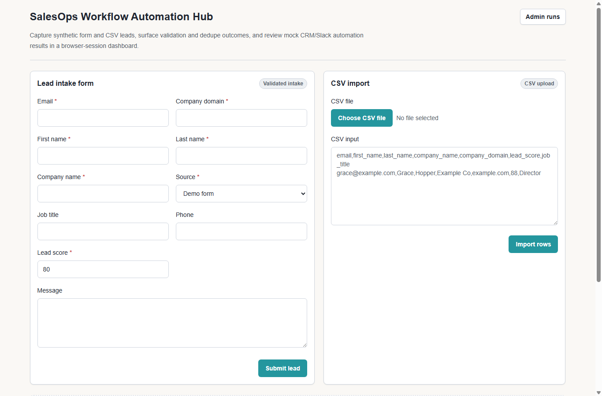
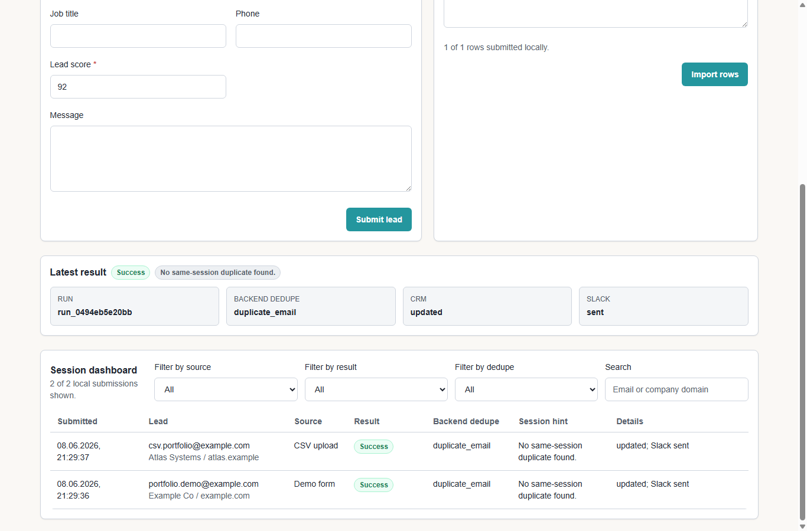
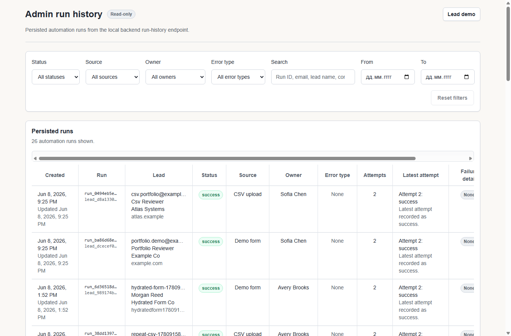
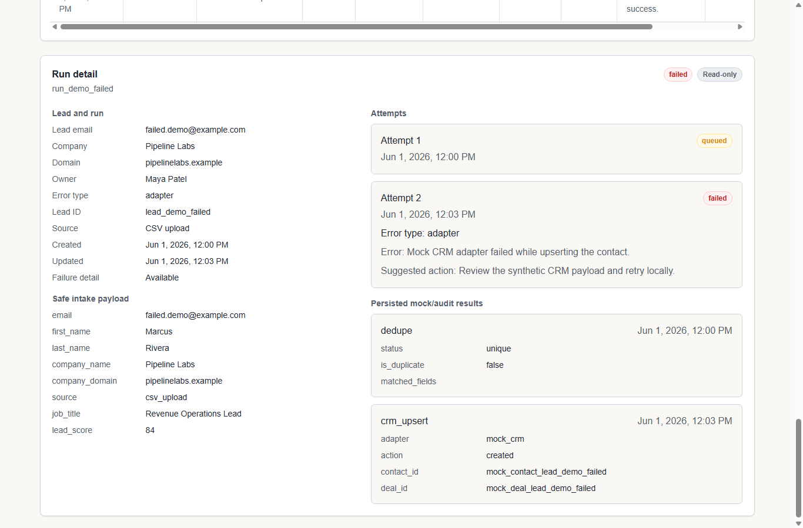
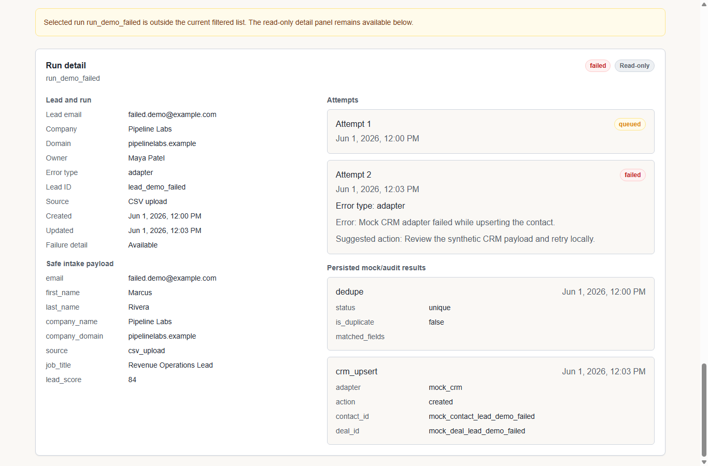

# SalesOps Workflow Automation Hub

SalesOps Workflow Automation Hub is a local-first portfolio demo for automating lead intake, validation, deduplication, mock CRM upsert, mock Slack notification, audit records, and admin run review.

The project is built for a fake growth agency with 5 sales reps. Leads arrive from forms and CSV uploads; manual CRM and Slack handoffs create duplicates, slow response, missed follow-up, and weak auditability. This repo shows a code-first workflow that makes those steps traceable in a local mock-safe environment.

## What It Does

- Accepts synthetic leads through a FastAPI intake endpoint and a Next.js demo form.
- Imports CSV leads through the frontend and submits them through the same local intake path.
- Validates lead payloads with Pydantic.
- Detects duplicates by email and company domain against persisted local lead snapshots.
- Simulates CRM contact/deal create-or-update behavior with a mock adapter.
- Simulates Slack notifications for qualified leads with a mock adapter.
- Persists local lead, automation run, attempt, and audit records.
- Shows a read-only admin run-history dashboard with date, source, status, owner, error-type, and search filters.
- Shows selected run details with sanitized payload, validation/failure context, attempts, and suggested action.
- Keeps manual retry as a backend-only local endpoint; the public admin demo stays read-only.

## Tech Stack

| Area | Technology |
|---|---|
| Backend | FastAPI, Python 3.12+, Pydantic, SQLAlchemy, Alembic |
| Backend tooling | uv, pytest, Ruff, mypy |
| Database | PostgreSQL through Docker Compose; SQLite only for unit-test fallback |
| Frontend | Next.js App Router, TypeScript, Tailwind CSS, TanStack Table, local shadcn-style primitives |
| Frontend tooling | pnpm, Vitest, Testing Library |
| Integrations | Mock CRM and mock Slack adapters only |

## Local And Mock-Only Safety

This repository is intentionally local-only by default.

- No real HubSpot, Slack, Google Sheets, OpenAI, paid API, production API, webhook, or external-provider call is required for the demo.
- `.env.example` contains placeholders only. Keep local values in ignored `.env` files and do not commit secrets.
- No GitHub Actions, deployment config, production credentials, or live provider setup is included.
- Future real-provider work requires a separate approved phase; see [HANDOFF.md](HANDOFF.md) for safe boundaries.

## Screenshots

Portfolio-ready screenshots are stored under `docs/assets/screenshots/` and use synthetic local data only.











Asset notes are in [docs/assets/README.md](docs/assets/README.md).

## Quick Start

Prerequisites:

- Windows 11 with PowerShell.
- Python 3.12+ and `uv`.
- Node.js, Corepack, and `pnpm`.
- Docker Desktop for local PostgreSQL.

From the repository root:

```powershell
if (-not (Test-Path -LiteralPath ".env")) { Copy-Item -LiteralPath ".env.example" -Destination ".env" }
uv sync
pnpm install
docker compose up -d postgres
uv run alembic upgrade head
uv run python -m backend.app.leads.demo_seed
```

Start the backend in one PowerShell window:

```powershell
uv run uvicorn backend.app.main:app --host 127.0.0.1 --port 8028
```

Start the frontend in another PowerShell window:

```powershell
$env:BACKEND_API_BASE_URL = "http://127.0.0.1:8028"
$env:NEXT_PUBLIC_BACKEND_API_BASE_URL = "http://127.0.0.1:8028"
pnpm --dir apps/web exec next dev --hostname 127.0.0.1 --port 3042
```

Open:

- `http://127.0.0.1:3042/` for the public lead form and CSV import.
- `http://127.0.0.1:3042/admin/runs` for the read-only run dashboard.
- `http://127.0.0.1:8028/docs` for local FastAPI docs.

## Suggested Demo Walkthrough

1. Submit one synthetic lead from `/` and show validation, backend dedupe, mock CRM, and mock Slack results.
2. Import one valid CSV row and show it in the browser-session dashboard.
3. Open `/admin/runs` and show seeded success, failed, queued, and retried runs.
4. Filter by status, source, owner, error type, date, and search text.
5. Open `run_demo_failed` and show sanitized failure detail and suggested action.
6. Point out that the admin UI is read-only and all provider behavior is mocked locally.

The full handoff and 3-5 minute script are in [HANDOFF.md](HANDOFF.md). Detailed local operations are in [RUNBOOK.md](RUNBOOK.md).

## Validation Commands

Run from the repository root:

```powershell
git status --short
git diff --check
uv run mypy .
uv run pytest
uv run ruff check .
pnpm --dir apps/web run lint
pnpm --dir apps/web exec vitest run
pnpm --dir apps/web run typecheck
pnpm --dir apps/web run build
```

If Docker Desktop is available, also validate the documented local database demo path:

```powershell
docker compose up -d postgres
uv run alembic upgrade head
uv run python -m backend.app.leads.demo_seed
```

## Documentation Map

- [REQ.md](REQ.md): requirements, acceptance criteria, and out-of-scope items.
- [DESIGN.md](DESIGN.md): architecture, data model, and local integration boundaries.
- [RUNBOOK.md](RUNBOOK.md): setup, local smoke checks, troubleshooting, and manual QA.
- [TDD.md](TDD.md): test strategy and coverage matrix.
- [HANDOFF.md](HANDOFF.md): reviewer demo sequence and future credential boundary notes.
- [STATE.md](STATE.md): current phase status, latest validation, skipped checks, and known issues.

## Project Status And Limitations

Current status: portfolio-ready local demo, not a production service.

Known boundaries:

- Real CRM, Slack, Google Sheets, OpenAI, paid-provider, production API, webhook, deployment, auth, and CI flows are intentionally absent.
- The admin UI is read-only; backend retry exists for local workflow records but is not exposed in the public admin page.
- Demo seed data is synthetic and deterministic.
- Local PostgreSQL is the documented demo database. SQLite is only used by tests where it is justified as a local fallback.
- Browser recording or video export is not committed; the demo script is documented for manual recording.

Codex must not stage, commit, or push. The user manually reviews, stages, commits, and pushes after local validation.
