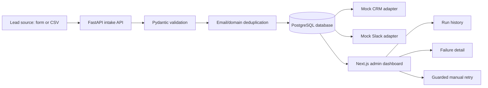

# SalesOps Workflow Automation Hub

## 60-second client read

This is a client-style portfolio demo for automating a sales lead workflow: form/CSV intake -> validation -> deduplication -> mock CRM/Slack handoff -> audit/run history -> failure review -> guarded manual retry.

**Best-fit client problem:** a small agency or sales team receives leads from forms, CSV uploads, landing pages, or manual sources, then wastes time copying data into a CRM, notifying sales reps, checking duplicates, and investigating failed handoffs.

**Business value demonstrated:** faster lead handling, fewer duplicate records, clearer owner assignment, visible failure states, and a safer retry path when automation runs fail.

**Technical proof:** FastAPI intake API, Pydantic validation, PostgreSQL persistence, SQLAlchemy/Alembic, Next.js public lead form and admin dashboard, frontend CSV import, mock CRM adapter, mock Slack adapter, run history, failure detail, guarded manual retry, tests, and Docker-based local setup.

**Demo safety:** all data is synthetic. CRM and Slack behavior is mocked. No real HubSpot, Slack, Google Sheets, paid API, live webhook, production API, or production credential is required. Real-provider work is a separate future/client adaptation phase.

## What It Does

- Accepts synthetic leads through a FastAPI intake endpoint and a Next.js demo form.
- Imports CSV leads through the frontend and submits them through the same local intake path.
- Validates lead payloads with Pydantic.
- Detects duplicates by email and company domain against persisted local lead snapshots.
- Simulates CRM contact/deal create-or-update behavior with a mock adapter.
- Simulates Slack notifications for qualified leads with a mock adapter.
- Persists local lead, automation run, attempt, and audit records.
- Shows a local-only admin run-history dashboard with date, source, status, owner, error-type, and search filters.
- Shows selected run details with sanitized payload, validation/failure context, attempts, and suggested action.
- Lets failed or queued selected runs be retried through the local admin detail panel while preserving history.

## Demo Proof Points

- Form and CSV leads use the same local intake path.
- Invalid or duplicate-prone leads produce inspectable validation, dedupe, and failure evidence.
- Qualified synthetic leads show mock CRM and mock Slack outcomes without leaving the local environment.
- Seeded success, failed, queued, and retried runs make the admin dashboard useful immediately after setup.
- Reviewers can filter run history by date, source, status, owner, error type, and search text, then inspect sanitized failure detail.

## Tech Stack

| Area | Technology |
|---|---|
| Backend | FastAPI, Python 3.12+, Pydantic, SQLAlchemy, Alembic |
| Backend tooling | uv, pytest, Ruff, mypy |
| Database | PostgreSQL through Docker Compose; SQLite only for unit-test fallback |
| Frontend | Next.js App Router, TypeScript, Tailwind CSS, TanStack Table, local shadcn-style primitives |
| Frontend tooling | pnpm, Vitest, Testing Library |
| Integrations | Mock CRM and mock Slack adapters only |

## Safety Boundaries

This repository is intentionally local-only by default.

- No real HubSpot, Slack, Google Sheets, OpenAI, paid API, production API, webhook, or external-provider call is required or made by the demo.
- `.env.example` contains placeholders only. Keep local values in ignored `.env` files and do not commit credential values.
- No GitHub Actions, deployment config, production credentials, or live-provider setup is included.
- The admin dashboard is local-only; manual retry is exposed only for failed or queued selected runs and still goes through local mock-provider safety checks.
- Backend retry refuses unsafe non-local or non-mock provider settings before mutating local run records.
- Future real-provider work requires a separate approved phase; see [HANDOFF.md](HANDOFF.md) for safe boundaries.

## Reliability features

- Pydantic schema validation normalizes and rejects invalid lead payloads before persistence.
- The frontend CSV parser validates required columns, email/domain formats, source values, and lead score ranges before local submission.
- Persisted email/domain duplicate handling detects exact email matches and possible company-domain duplicates against local lead snapshots.
- PostgreSQL-backed lead, run, attempt, and audit records preserve run history and mock handoff evidence.
- Run detail exposes only allowlisted and sanitized payload/audit fields for failure review.
- Manual retry is limited to failed or queued selected runs and appends a local retry attempt while preserving prior history.
- Retry is blocked before mutation when local/mock provider settings are unsafe.
- Mock CRM and Slack adapters are deterministic and do not call live providers.
- Demo seed/reset behavior is local/demo-only and targets rows marked as demo data.
- Backend pytest coverage and frontend Vitest/Testing Library coverage exercise validation, dedupe, persistence, run history, failure detail, retry guardrails, CSV import, and admin UI behavior.

## Architecture at a glance



## Screenshots

Portfolio-ready screenshots are stored under `docs/assets/screenshots/` and use synthetic local data only.

| Proof point | What it shows | Asset |
| --- | --- | --- |
| Lead form | Synthetic lead intake from the public form | [salesops-home.png](docs/assets/screenshots/salesops-home.png) |
| CSV import | Batch lead intake through CSV upload/import | [salesops-csv-session-dashboard.png](docs/assets/screenshots/salesops-csv-session-dashboard.png) |
| Admin run history | Local run/audit history and status review | [salesops-admin-run-history.png](docs/assets/screenshots/salesops-admin-run-history.png) |
| Failure detail / retry | Failure context, retry guardrails, and manual retry path | [salesops-admin-failed-detail.png](docs/assets/screenshots/salesops-admin-failed-detail.png) |

Additional local captures for filtered admin states, local API docs, and mobile layouts are also kept in `docs/assets/screenshots/`.

Asset notes are in [docs/assets/README.md](docs/assets/README.md), and the optional capture checklist is in [docs/DEMO_ASSETS.md](docs/DEMO_ASSETS.md).

Final still screenshots belong in `docs/assets/screenshots/`. Optional GIFs or short recordings belong in `docs/assets/demo/` and should stay untracked until intentionally selected for the portfolio. The exact capture checklist, suggested filenames, and desktop/mobile viewport recommendations are in [docs/DEMO_ASSETS.md](docs/DEMO_ASSETS.md).

## Demo video

Demo video: TODO — record a 60-90 second walkthrough covering form intake, CSV import, run history, failure detail, and retry.

No GIF or video binary is currently committed. Future local-only recordings should use `docs/assets/demo/` and follow [docs/DEMO_ASSETS.md](docs/DEMO_ASSETS.md).

## Client adaptation paths

These are real-client extension paths, not active live integrations in this local demo.

- **HubSpot or Pipedrive:** replace the mock CRM adapter with authenticated contact/deal upsert calls, duplicate checks, and owner assignment rules.
- **Airtable or Google Sheets:** use form/CSV rows or sheet records as intake sources or lightweight CRM records.
- **Slack:** replace the mock notification adapter with channel/user notifications for qualified leads, failed handoffs, and retry outcomes.
- **Routing rules:** adapt lead assignment by territory, service line, budget, lead score, or account owner.
- **Client handoff:** add client-specific monitoring, runbook steps, and credential rotation documentation after real-provider approval.

## Quick Start

Prerequisites:

- Windows 11 with PowerShell.
- Python 3.12+ and `uv`.
- Node.js, Corepack, and `pnpm`.
- Docker Desktop for local PostgreSQL.

From the repository root:

```powershell
if (-not (Test-Path -LiteralPath ".env")) { Copy-Item -LiteralPath ".env.example" -Destination ".env" }
uv sync --frozen
pnpm install --frozen-lockfile
docker compose up -d postgres
uv run --no-python-downloads --python 3.12 --frozen alembic upgrade head
uv run --no-python-downloads --python 3.12 --frozen python -m backend.app.leads.demo_reset --apply
```

The reset command is local/demo-only and dry-runs unless `--apply` is provided. With
`--apply`, it refuses non-local/mock settings, removes rows explicitly marked as
demo data through the local `is_demo` lead/run marker, keeps a narrow legacy
fallback for pre-marker known demo IDs and reserved example/test-domain synthetic
smoke rows, then reseeds the four marked portfolio demo runs.

Start the backend in one PowerShell window:

```powershell
uv run --no-python-downloads --python 3.12 --frozen uvicorn backend.app.main:app --host 127.0.0.1 --port 8028
```

Start the frontend in another PowerShell window:

```powershell
$env:BACKEND_API_BASE_URL = "http://127.0.0.1:8028"
$env:NEXT_PUBLIC_BACKEND_API_BASE_URL = "http://127.0.0.1:8028"
pnpm --dir apps/web exec next dev --hostname 127.0.0.1 --port 3042
```

Open:

- `http://127.0.0.1:3042/` for the public lead form and CSV import.
- `http://127.0.0.1:3042/admin/runs` for the local-only run dashboard.
- `http://127.0.0.1:3042/docs` to redirect to the local FastAPI docs at `http://127.0.0.1:8028/docs`, which links to `http://127.0.0.1:8028/openapi.json`.

## Suggested Demo Walkthrough

1. Submit one synthetic lead from `/` and show validation, backend dedupe, mock CRM, and mock Slack results.
2. Import one valid CSV row and show it in the browser-session dashboard.
3. Open `/admin/runs` and show seeded success, failed, queued, and retried runs.
4. Filter by status, source, owner, error type, date, and search text.
5. Open `run_demo_failed` and show sanitized failure detail, suggested action, and the local retry action.
6. Point out that admin retry remains local/mock-only and all provider behavior is mocked locally.

The concise local reviewer checklist is in [docs/DEMO_SCRIPT.md](docs/DEMO_SCRIPT.md). The portfolio case study is in [docs/CASE_STUDY.md](docs/CASE_STUDY.md). The full handoff and 3-5 minute script are in [HANDOFF.md](HANDOFF.md). Recommended screenshot, GIF, and video shots are in [docs/DEMO_ASSETS.md](docs/DEMO_ASSETS.md). Detailed local operations are in [RUNBOOK.md](RUNBOOK.md).

## Local Validation

These checks are intended to run locally from PowerShell before treating the portfolio demo as ready for review. They do not require paid APIs or real provider calls.

Run from the repository root:

```powershell
git status --short --branch
git diff --check
uv sync --frozen
uv run --no-python-downloads --python 3.12 --frozen pytest
uv run --no-python-downloads --python 3.12 --frozen ruff check .
uv run --no-python-downloads --python 3.12 --frozen ruff format --check .
uv run --no-python-downloads --python 3.12 --frozen mypy backend tests
pnpm install --frozen-lockfile
pnpm --dir apps/web lint
pnpm --dir apps/web test -- --run
pnpm --dir apps/web typecheck
pnpm --dir apps/web build
```

If Docker Desktop is available, also validate the documented local database demo path:

```powershell
docker compose up -d postgres
uv run --no-python-downloads --python 3.12 --frozen alembic upgrade head
uv run --no-python-downloads --python 3.12 --frozen python -m backend.app.leads.demo_reset --apply
```

## Documentation Map

- [REQ.md](REQ.md): requirements, acceptance criteria, and out-of-scope items.
- [DESIGN.md](DESIGN.md): architecture, data model, and local integration boundaries.
- [RUNBOOK.md](RUNBOOK.md): setup, local smoke checks, troubleshooting, and manual QA.
- [docs/DEMO_SCRIPT.md](docs/DEMO_SCRIPT.md): concise local reviewer checklist and asset inventory.
- [docs/DEMO_ASSETS.md](docs/DEMO_ASSETS.md): optional screenshot, GIF, and video capture checklist.
- [docs/PORTFOLIO_LISTING.md](docs/PORTFOLIO_LISTING.md): concise client-facing portfolio listing package.
- [docs/CASE_STUDY.md](docs/CASE_STUDY.md): concise portfolio case study for reviewers and clients.
- [TDD.md](TDD.md): test strategy and coverage matrix.
- [HANDOFF.md](HANDOFF.md): reviewer demo sequence and future credential boundary notes.
- [STATE.md](STATE.md): current phase status, latest validation, skipped checks, and known issues.

## Project Status And Limitations

Current status: portfolio-ready local demo, not a production service.

See [STATE.md](STATE.md) for the latest pass criteria, validation history, skipped-gate reasons, manual browser verification steps, and remaining risks.

Known boundaries:

- Real CRM, Slack, Google Sheets, OpenAI, paid-provider, production API, webhook, deployment, auth, and CI flows are intentionally absent.
- The admin UI exposes local manual retry only for failed or queued selected runs; demo reset, provider-send, edit, delete, archive, and unsafe reset actions remain absent.
- Demo seed data is synthetic and deterministic.
- Canonical demo leads and runs are explicitly marked as demo data for local reset targeting.
- Local PostgreSQL is the documented demo database. SQLite is only used by tests where it is justified as a local fallback.
- Browser recording or video export is not committed; the demo script is documented for manual recording.

Codex must not stage, commit, or push. The user manually reviews, stages, commits, and pushes after local validation.
